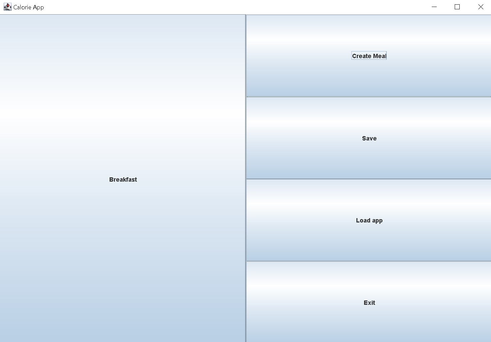
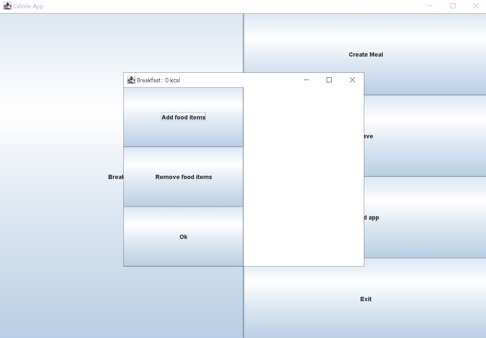

# Calorie Tracker App

The Calorie Tracker App is a simple, user-friendly application designed to help individuals monitor and manage their 
daily calorie intake.

## Usage

- To create a meal, click on the 'create meal' button and enter its name.
- To add and remove food items, click on the meal, and click on 'add food items'.
- To save the app, click on the 'save app' button, and exit the app. To load the saved state, click on 'load app' to access the saved state. (Saving rewrites the state of the app)

